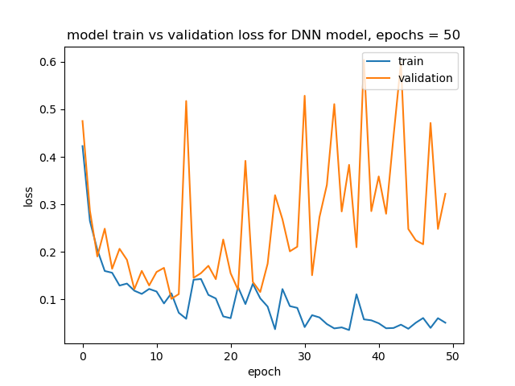
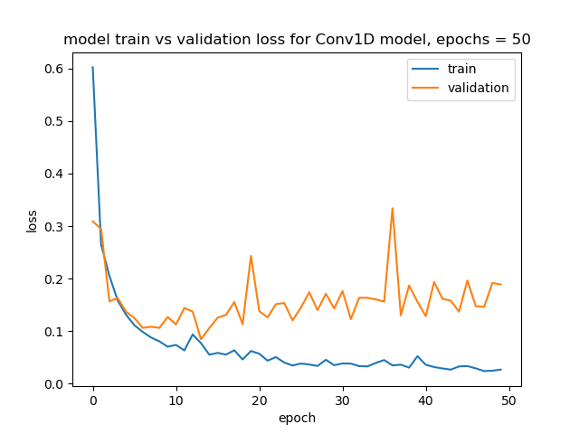
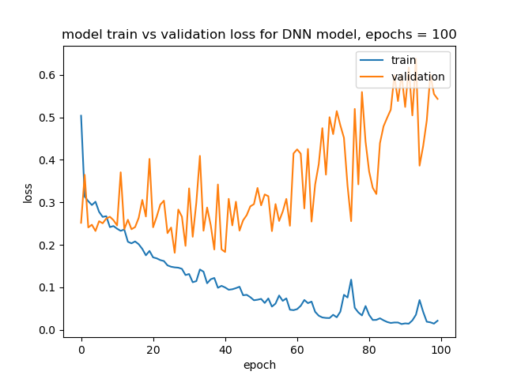
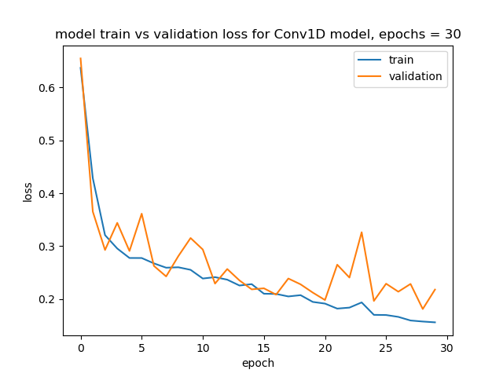
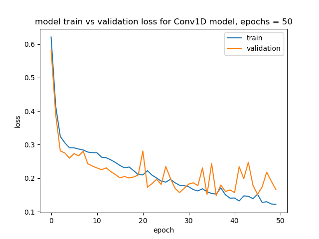
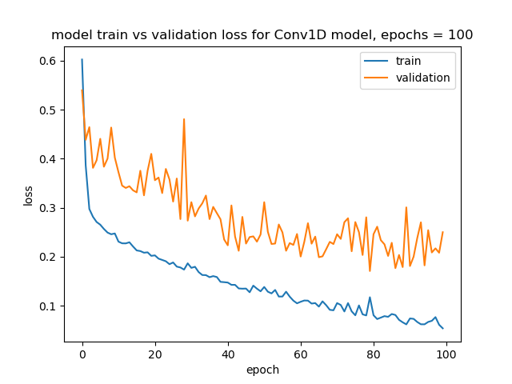

# CureAI
Applications of ML in Medical Sciences

## Breast Cancer Classifier
- Dataset: `Breast_cancer_wisconsindata.csv`
- Features: `id, clump_thickness, unif_cell_size, unif_cell_shape, marg_adhesion, single_epith_cell_size, bare_nuclei, bland_chrom, norm_nucleoli, mitoses, class`
- Initial Shape = `(699,11)`
- Trainable shape = `(699,9)`
- Output = `2 [0,1] or [1,0]`
- train-test split = `(0.2)`

## Model Architectures: (Type = Sequential):
- Deep Neural Network, DNN (4 layers)
- Convolutional 1D Deep Neural Network (Conv1D, 2 convolution,1 maxpooling, 1 flatten, 2 Dense layers)

# Training and Validation graphs per epochs:

### DNN Model (Without Preprocessing):

 
 
### CNN1d Model (Without Preprocessing):

### DNN Model (With Preprocessing):

 
 
### CNN1d Model (With Preprocessing):

### Conclusion:
Clearly, the dataset is `small` enough for reducing the `validation loss` close to `training loss` and the `variance` of the dataset is a bit high, yet, the `CNN1d` model trained better than the `DNN model` for the most part of the training and validation `(Cross-Validation)` with preprocessing.
